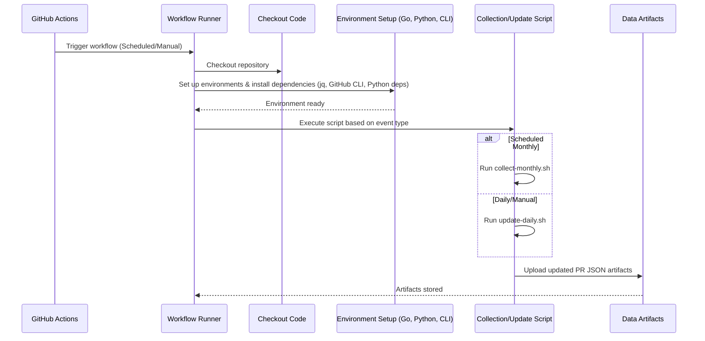
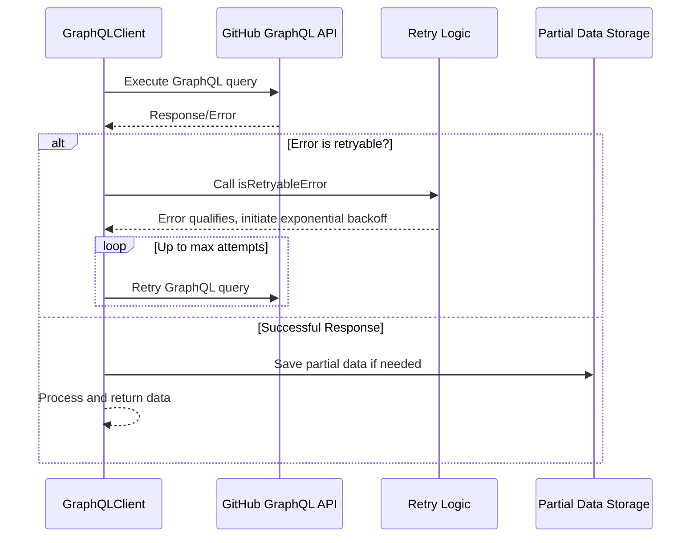

# Jenkins Plugin PR Statistics Collector

This repository contains tools and automation for collecting and analyzing Pull Request (PR) statistics for Jenkins plugins. It helps track open, merged, and failing PRs across the Jenkins ecosystem.

## Overview

The system collects PR data from GitHub repositories related to Jenkins plugins, processes this data, and uploads statistics to Google Sheets for analysis. The collection process runs both automatically (via GitHub Actions) and can be run manually when needed.

## Scripts and Their Functions

### Core Scripts

1. `jenkins-pr-collector.go`
   - Main data collection script written in Go
   - Queries GitHub's GraphQL API to fetch PR data for Jenkins plugins
   - Usage: `go run jenkins-pr-collector.go -start "YYYY-MM-DD" -end "YYYY-MM-DD" -output "output_file.json"`
   - Logs output to stdout/stderr for monitoring

2. `collect-monthly.sh`
   - Collects PR data for a specific month
   - Parameters:
     - `YYYY-MM`: Target month (optional, defaults to last month)
     - `UPDATE_SHEETS`: Boolean flag to update Google Sheets (optional, defaults to false)
   - Creates monthly data files in `data/monthly/`
   - Updates consolidated data files in `data/consolidated/`
   - Usage: `./collect-monthly.sh "2024-03" true`
   - Logs progress and errors to stdout

3. `group-prs.sh`
   - Processes and groups PR data by title and status
   - Called by `collect-monthly.sh`
   - Requires `plugins.json` file for plugin information
   - Usage: `./group-prs.sh "input_file.json" "plugins.json"`
   - Logs grouping statistics to stdout

4. `retry-collection.sh`
   - Bulk data collection script with retry mechanism
   - Collects data from July 2024 onwards
   - Implements exponential backoff for failed attempts
   - Updates Google Sheets only after all data is collected
   - Usage: `./retry-collection.sh`
   - Logs retry attempts and progress to stdout

### Supporting Scripts

5. `upload_to_sheets.py`
   - Python script for uploading data to Google Sheets
   - Requires Google Sheets API credentials
   - Called by other scripts when `UPDATE_SHEETS` is true
   - Logs upload status and any API errors to stdout

## Directory Structure

\`\`\`
.
├── data/
│   ├── monthly/      # Monthly PR data files
│   ├── consolidated/ # Consolidated data files
│   ├── archive/      # Archived data (older than 6 months)
│   └── backup/       # Backup directory for data files
├── .github/
│   └── workflows/    # GitHub Actions workflow files
└── scripts/         # Collection and processing scripts
\`\`\`

## Automated Workflows

### PR Stats Workflow (`pr-stats.yml`)
- **Monthly Collection** (2nd of each month)
  - Runs full data collection for the previous month
  - Updates consolidated statistics
  - Updates Google Sheets
  - Creates a backup of all data before running
  - Logs available in GitHub Actions run history
  - Expected duration: 15–30 minutes

- **Daily Updates** (midnight UTC)
  - Updates current month's data
  - Updates open and failing PR statistics
  - Updates Google Sheets with latest data
  - Creates a backup of current data
  - Logs available in GitHub Actions run history
  - Expected duration: 5–10 minutes

### PR Collector Test (`pr-collector-test.yml`)
- Runs every Tuesday at 07:18 UTC
- Tests the PR collector functionality
- Creates a pull request with updated statistics
- Uses Docker for isolated testing environment
- Logs available in GitHub Actions run history
- Expected duration: 10–15 minutes

## Logging and Monitoring

### GitHub Actions Logs
- All automated runs log their output to GitHub Actions
- Access logs through the "Actions" tab in the repository
- Logs are retained for 90 days
- Each run includes:
  - Setup steps
  - Script execution output
  - Error messages (if any)
  - Completion status

### Data Collection Logs
- Scripts log to stdout/stderr
- Key information logged includes:
  - Start and end times of operations
  - Number of PRs processed
  - API rate limit status
  - Error messages and retry attempts
  - Google Sheets update status

### Monitoring Points
1. **GitHub Actions Status**
   - Check Actions tab for failed runs
   - Review logs for rate limit warnings
   - Verify backup creation

2. **Data Integrity**
   - Verify monthly files are created
   - Check consolidated data updates
   - Confirm Google Sheets updates

3. **Storage Management**
   - Monitor backup directory size
   - Check archive rotation
   - Verify data retention policies

## Getting Started

### Initial Setup

1. Clone the repository:
   ```bash
   git clone https://github.com/your-org/alpha-omega-stats.git
   cd alpha-omega-stats
   ```

2. Install dependencies:
   ```bash
   # Go dependencies
   go mod download

   # Python dependencies
   python -m venv venv
   source venv/bin/activate  # or `venv\Scripts\activate` on Windows
   pip install -r requirements.txt
   ```

3. Set up credentials:
   - Create a GitHub token with necessary permissions
   - Set up Google Sheets API credentials
   - Configure environment variables as needed

### Running Data Collection

#### For Initial Data Collection
```bash
# This will collect all data from July 2024 onwards
./retry-collection.sh
```

#### For Monthly Maintenance
```bash
# Collect data for a specific month
./collect-monthly.sh "YYYY-MM" true
```

## Example Usage

Here are some common usage examples:

```bash
# Count PRs for repositories listed in repos.txt for the year 2024
./count_prs.sh repos.txt 2024

# Compute statistics for specified users between dates
./compute-stats.sh gounthar,jonesbusy 2024-12-01 2025-01-15

# Group PRs by plugin using the plugins.json configuration
./group-prs.sh prs_gounthar_and_others_2024-12-01_to_2025-01-15.json plugins.json
```

### Command Explanations

#### Count PRs
The `count_prs.sh` script counts pull requests for a list of repositories:
- First argument: Path to a text file containing repository names
- Second argument: Year to analyze

#### Compute Statistics
The `compute-stats.sh` script generates detailed statistics for specific users:
- First argument: Comma-separated list of GitHub usernames
- Second argument: Start date in YYYY-MM-DD format
- Third argument: End date in YYYY-MM-DD format

#### Group PRs
The `group-prs.sh` script organizes pull requests by plugin:
- First argument: JSON file containing PR data
- Second argument: Plugin configuration file

## Sequence Diagram(s)





## Maintenance Tasks

### Monthly Tasks
1. Check the automated collection ran successfully on the 2nd
   - Review GitHub Actions logs
   - Verify data files are created
   - Check Google Sheets updates

2. Verify data in Google Sheets is updated
   - Check latest data timestamp
   - Verify all sheets are updated
   - Review data consistency

3. Review any failed collections in the GitHub Actions logs
   - Check for rate limit issues
   - Review error messages
   - Plan retries if needed

### As-Needed Tasks
1. Review and clean up archived data
   - Verify archive rotation
   - Check storage usage
   - Clean up old backups

2. Verify backup integrity
   - Test backup restoration
   - Check backup completeness
   - Update backup strategy if needed

3. Update dependencies as needed
   - Check for security updates
   - Review dependency versions
   - Test updates in development

## Troubleshooting

1. **Rate Limiting**
   - The scripts include built-in retry mechanisms with exponential backoff
   - Check GitHub API quota in the logs
   - Adjust collection timing if needed
   - Monitor rate limit headers in responses

2. **Failed Collections**
   - Check the logs in `data/monthly/` for specific errors
   - Use `retry-collection.sh` to retry failed periods
   - Verify GitHub token permissions
   - Review network connectivity issues

3. **Google Sheets Issues**
   - Verify API credentials are valid
   - Check Python virtual environment is activated
   - Review logs for API errors
   - Verify sheet permissions

4. **Data Inconsistencies**
   - Compare monthly and consolidated data
   - Check for missing or duplicate entries
   - Verify data format consistency
   - Review archive integrity

## Contributing

1. Fork the repository
2. Create a feature branch
3. Submit a pull request with a clear description of changes

## License

This project is licensed under the MIT License - see the LICENSE file for details.

